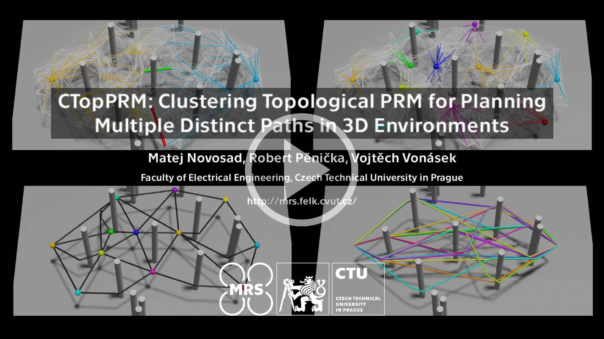

# CTopPRM: Clustering Topological PRM for Planning Multiple Distinct Paths in 3D Environments
This repository contains the code for **CTopPRM: Clustering Topological PRM for Planning Multiple Distinct Paths in 3D Environments** presented in our paper [Novosad, Penicka, Vonasek CTopPRM'23](https://arxiv.org/abs/2305.13969).
[](https://www.youtube.com/watch?v=azNrWBU5cAk/)

## Citing
If you use this code in an academic context, please cite the following publication:

M. Novosad, R. Penicka and V. Vonasek, "CTopPRM: Clustering Topological PRM for Planning Multiple Distinct Paths in 3D Environments," in IEEE Robotics and Automation Letters, doi: 10.1109/LRA.2023.3315539. ([PDF](https://arxiv.org/pdf/2305.13969.pdf))

```bash
@ARTICLE{10251650,
  author={Novosad, Matej and Penicka, Robert and Vonasek, Vojtech},
  journal={IEEE Robotics and Automation Letters}, 
  title={CTopPRM: Clustering Topological PRM for Planning Multiple Distinct Paths in 3D Environments}, 
  year={2023},
  volume={},
  number={},
  pages={1-8},
  doi={10.1109/LRA.2023.3315539}}
}
```

## License
GPL-3.0 License. Copyright (C) 2022 M. Novosad, R. Pěnička, V. Vonásek (Faculty of Electrical Engineering, Czech Technical University in Prague).

This is a research code, expect that it changes often and any fitness for a particular purpose is disclaimed.

## Installation and usage
The code has been developed and tested on Ubuntu 22.04.

### Downloading the code
Clone the repository and update the submodules

`git clone git@github.com:ctu-mrs/CTopPRM.git`

`cd CTopPRM/`

`git submodule update --init --recursive`

`gitman update`

You might have to install gitman first
`pip install gitman`

### Compilation and dependencies
Install the following dependencies

`sudo apt-get install build-essential cmake pkg-config ccache zlib1g-dev libomp-dev libyaml-cpp-dev libhdf5-dev libgtest-dev liblz4-dev liblog4cxx-dev libeigen3-dev python3 python3-venv python3-dev python3-wheel python3-opengl`

Compile the dependencies present in submodules

`make dependencies`

Finally, compile the code

`make`

### Maps preparation
To create the ESDF maps from the mesh .obj fles use the map.py script in the python folder. To have all the dependencies we suggest using the python environment. Start the environment and activate it using:

`python3 -m venv env`
`source env/bin/activate`

Afterwards install the python dependencies using pip (or pip3 if python3 is not default):

`pip install setuptools~=57.5.0`

`pip install scikit-learn`

`pip install wheel`

`pip install pyopengl==3.1.0`

`pip install numpy trimesh matplotlib mesh_to_sdf python-csv`

When the dependencies are installed run the following command in the blender folder to create the ESDF maps (replace MESH_NAME with the name og the mesh file you wish to use):

`./map.py MESH_NAME.obj`

### Running the code
After compilation you should see the main binary. The prepared cofiguration files for exisitng maps are stored in config_files/ where the desired parameters and map can be set. Desired cofiguration file has to be defined in main.cpp. 
Before the code is run for the first time a directory for storing results has to be created:

`mkdir prints/`

Finally the code can simply be run using the command:

`./main`

### Visualization
To visualize results of the last run in blender follow the instructions:
 - import .obj file of the mesh of the evironments used to blender
 - open columns_2.py script
 - select folder in Line 147 to be 'prm', 'clusters', 'connections' or 'shortened' - depending on which step of the algorithm you want visualized
 - `is_cl = true` in line 142 for 'prm', 'clusters' and 'connections' AND main has to be run with `PRINT (true)` macro in topological_prm_clustering.hpp
 - run script
 
Some of the prepared .obj files are missing a cluster object required to visualize 'prm', 'clusters', 'connections' - to fix it just import prepared cluster.obj object into blender as well
